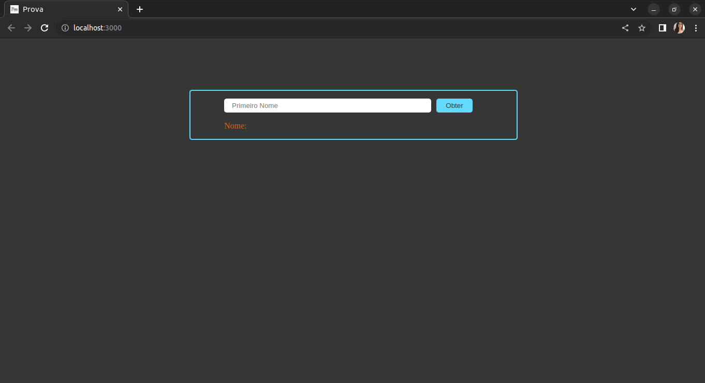
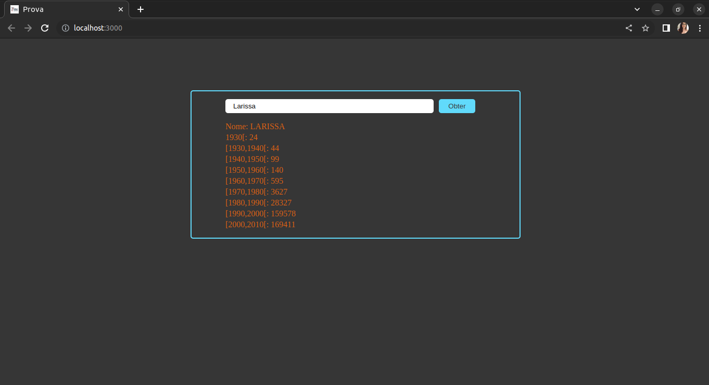

## Objetivo

Prova aplicada no 2º semestre de 2022 na disciplina eletiva Programação de Scripts pelo professor Arley Souza. A proposta era criar uma aplicação usando React JS para consumir um serviço disponibilizado pelo IBGE para consultar a ocorrência de nomes no decorrer das últimas décadas. A aplicação conta com um campo (input) no qual o usuário insere o nome desejado e, ao clicar no botão Obter, é retornada a quantidade de ocorrências registradas no serviço do IBGE, separadas por décadas.

## Resultados

   
   
  

